# 🏨 Hotel Booking System

A full-stack Hotel Booking Management System built using **Spring Boot 4**, **Java 17**, **Spring Data JPA**, **MySQL**, and modern web technologies.

The application allows customers to browse hotels, search available rooms, create bookings, make payments, and manage reservations, while administrators can manage hotels, rooms, and booking operations through a dedicated dashboard.

---

## 🚀 Project Highlights

### Key Features

✅ User Registration & Login

✅ Hotel Search & Filtering

✅ Room Availability Management

✅ Online Room Booking

✅ Booking Conflict Detection

✅ Payment Workflow

✅ Booking History Tracking

✅ Admin Dashboard

✅ Hotel Management

✅ Room Management

✅ Exception Handling

✅ Validation & Business Rules

✅ Layered Architecture

---

## 🏗️ System Architecture

```text
Frontend
    │
    ▼
Controllers (REST APIs)
    │
    ▼
Services (Business Logic)
    │
    ▼
Repositories (Spring Data JPA)
    │
    ▼
MySQL Database
```

### Architectural Pattern

```text
Controller
    ↓
Service
    ↓
Repository
    ↓
Entity
```

This architecture ensures:

* Separation of Concerns
* Maintainability
* Scalability
* Testability
* Clean Code Principles

---

## 🛠️ Technology Stack

| Category    | Technology         |
| ----------- | ------------------ |
| Language    | Java 17            |
| Framework   | Spring Boot 4.0.6  |
| ORM         | Hibernate          |
| Data Access | Spring Data JPA    |
| Database    | MySQL 8            |
| Validation  | Jakarta Validation |
| Build Tool  | Maven              |
| API Style   | REST               |
| IDE         | IntelliJ IDEA      |

---

# 📸 Application Screenshots

## 🔐 Login Page

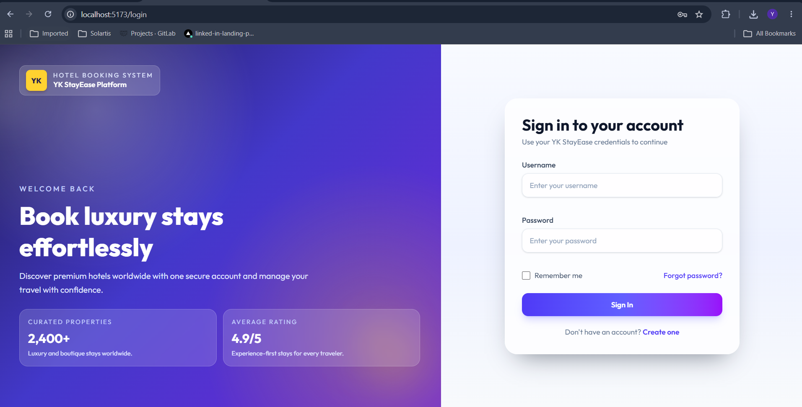

Secure login interface for users and administrators.

---

## 📊 User Dashboard

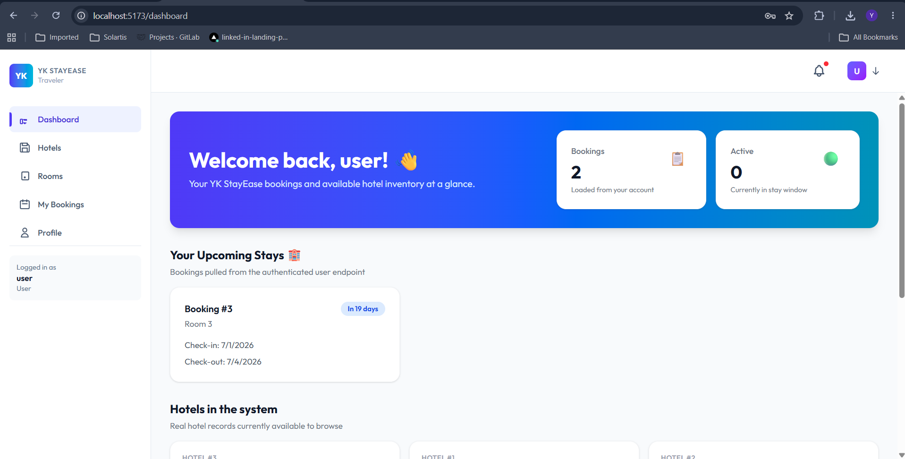

Users can view:

* Upcoming bookings
* Hotel listings
* Booking statistics
* Recent activities

---

## 🏨 Hotel Directory

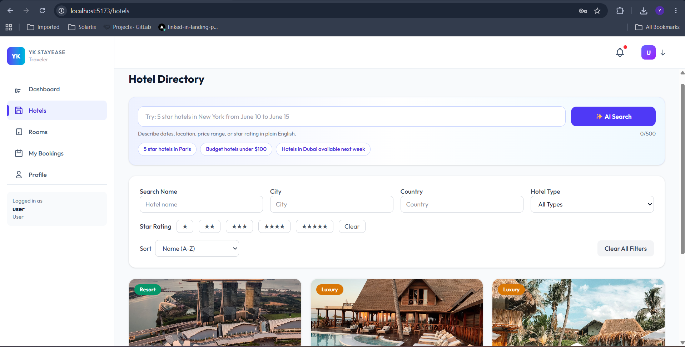

Features:

* Search hotels
* Filter by city
* Filter by country
* Filter by ratings
* View hotel details

---

## 🛏️ Room Directory

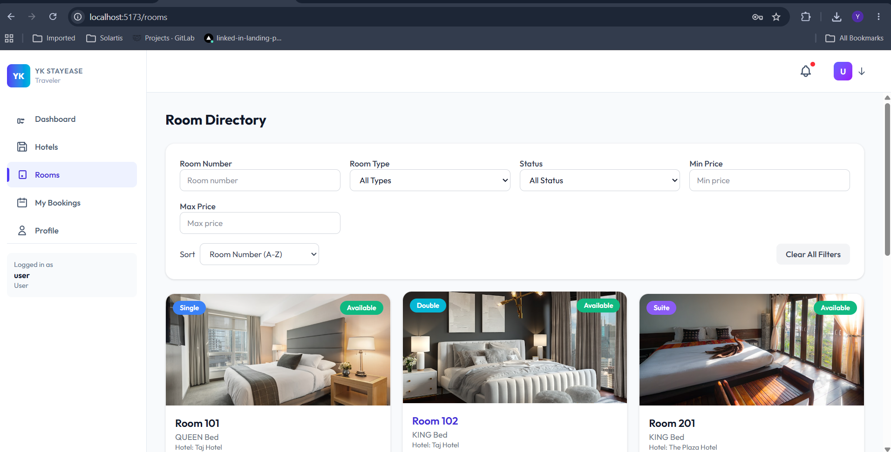

Features:

* Room listing
* Room pricing
* Capacity information
* Availability tracking

---

## 📅 Booking Creation

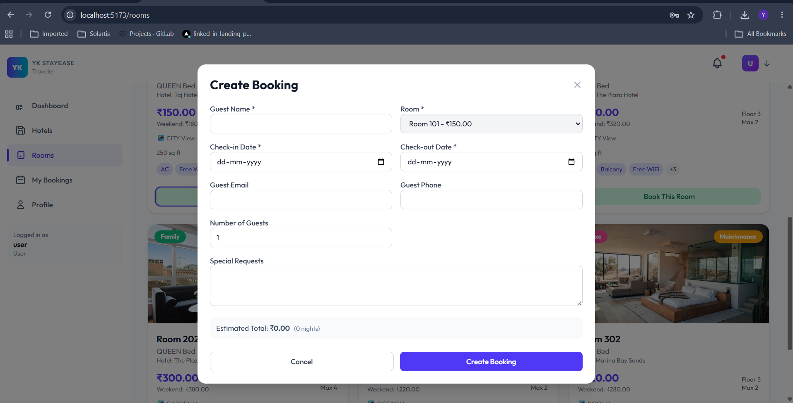

Users can:

* Select dates
* Choose room
* Add special requests
* Create reservations

---

## 📖 Booking History

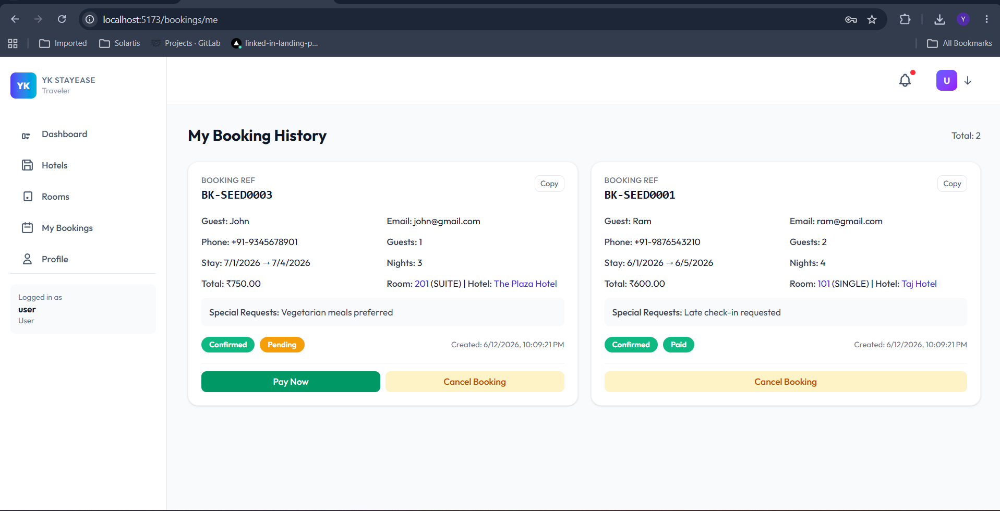

Features:

* View past bookings
* Booking status tracking
* Payment status
* Cancellation support

---

## 💳 Payment Module

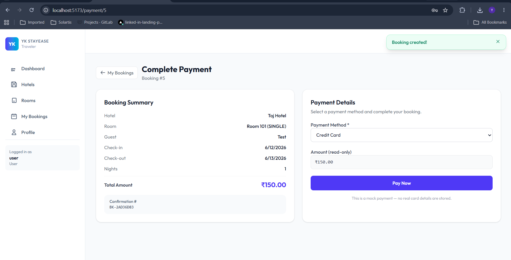

Features:

* Booking summary
* Payment information
* Secure payment flow

---

## ✅ Payment Success

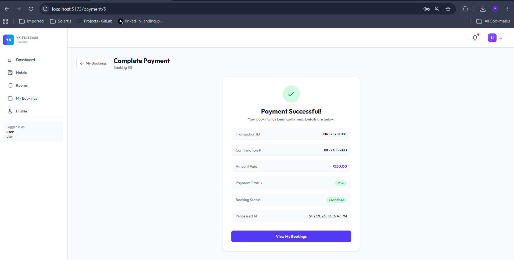

Displays:

* Booking confirmation
* Payment status
* Reference details

---

## 👨‍💼 Admin Dashboard

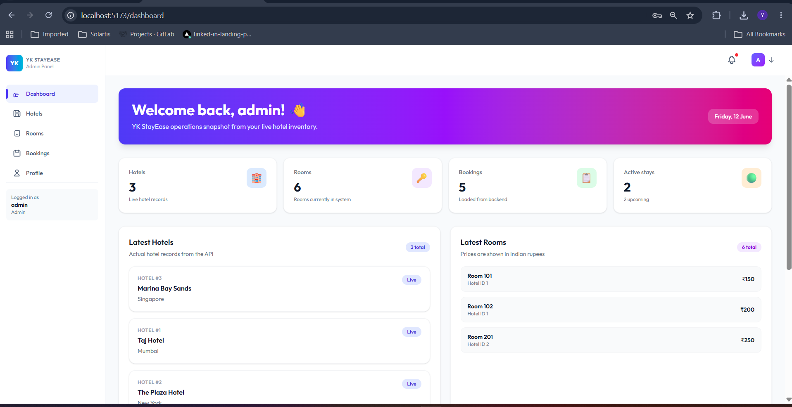

Admin can:

* Manage hotels
* Manage rooms
* Monitor bookings
* View statistics

---

## 🏨 Create Hotel

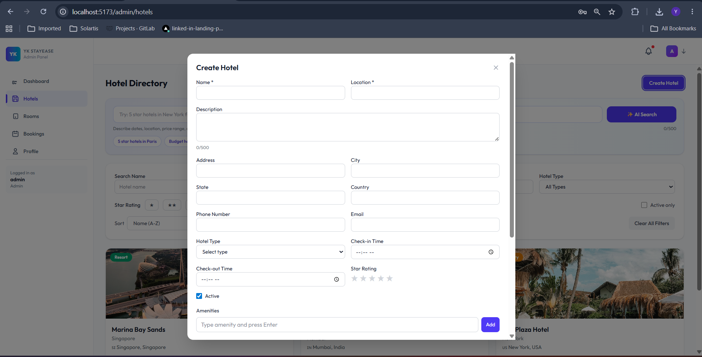

Admin hotel management functionality.

---

## 🛏️ Create Room

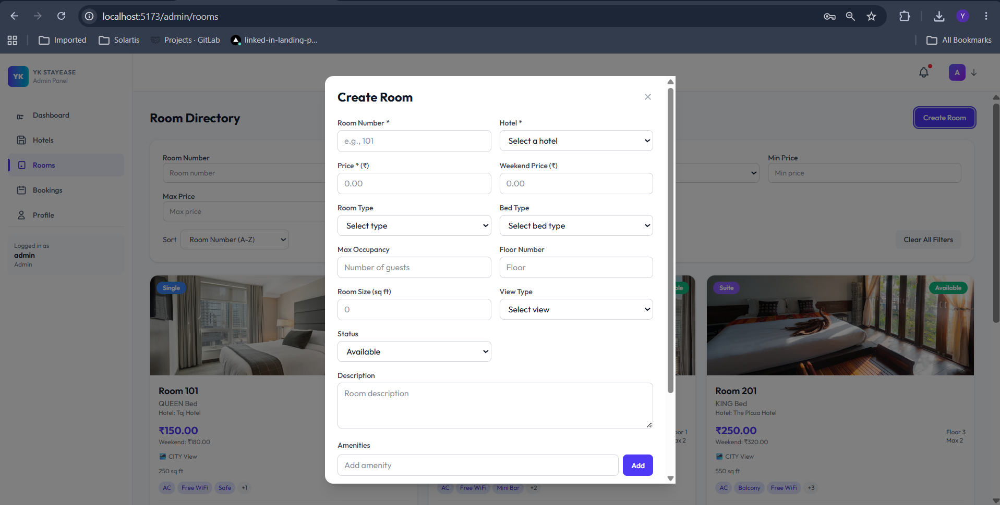

Admin room management functionality.

---

# 📦 Project Structure

```text
src/main/java/com/hotelbooking/simplehotelbookingapp

├── controller
│   ├── AuthController
│   ├── HotelController
│   ├── RoomController
│   └── BookingController
│
├── service
│   ├── AuthenticationService
│   ├── HotelService
│   ├── RoomService
│   └── BookingService
│
├── repository
│   ├── UserRepository
│   ├── HotelRepository
│   ├── RoomRepository
│   └── BookingRepository
│
├── entity
│   ├── User
│   ├── Hotel
│   ├── Room
│   └── Booking
│
├── dto
├── exception
└── configuration
```

---

# 🗄️ Database Design

### Tables

* users
* hotels
* rooms
* bookings

### Relationships

```text
User
  │
  └───< Booking >─── Room
                        │
                        │
                      Hotel
```

---

# 🔥 REST APIs

### Authentication

```http
POST /api/auth/register
POST /api/auth/login
```

### Hotel APIs

```http
GET    /api/v1/hotels
GET    /api/v1/hotels/{id}
POST   /api/v1/hotels
PUT    /api/v1/hotels/{id}
DELETE /api/v1/hotels/{id}
```

### Room APIs

```http
GET    /api/v1/rooms
GET    /api/v1/rooms/{id}
POST   /api/v1/rooms
PUT    /api/v1/rooms/{id}
DELETE /api/v1/rooms/{id}
```

### Booking APIs

```http
GET    /api/v1/bookings
POST   /api/v1/bookings
PATCH  /api/v1/bookings/{id}/status
DELETE /api/v1/bookings/{id}
```

---

# ⚡ Business Logic Implemented

### Room Availability Validation

* Prevents double booking
* Checks date overlap
* Validates room status

### Booking Conflict Detection

* Detects conflicting reservations
* Prevents invalid bookings

### Price Calculation

```java
Total Price = Number of Nights × Price Per Night
```

### Booking Lifecycle

```text
PENDING
   ↓
CONFIRMED
   ↓
COMPLETED

or

PENDING
   ↓
CANCELLED
```

---

# 🛡️ Exception Handling

Custom exceptions implemented:

* ResourceNotFoundException
* RoomNotAvailableException
* BookingConflictException
* InvalidDateException

Global exception handling ensures consistent API responses.

---

# 📈 Skills Demonstrated

### Backend

* Java 17
* Spring Boot
* Spring Data JPA
* Hibernate
* REST API Design
* Exception Handling
* Validation
* Transaction Management

### Database

* MySQL
* Entity Relationships
* Query Optimization
* Data Integrity

### Software Engineering

* Layered Architecture
* DTO Pattern
* SOLID Principles
* Clean Code
* Separation of Concerns

### Full Stack

* Backend API Development
* Database Design
* UI Integration
* End-to-End Business Workflow

---

# 🚀 Run Locally

### Clone Repository

```bash
git clone https://github.com/your-username/hotel-booking-system.git
```

### Create Database

```sql
CREATE DATABASE hotel_booking_db;
```

### Configure

```properties
spring.datasource.url=jdbc:mysql://localhost:3306/hotel_booking_db
spring.datasource.username=root
spring.datasource.password=your_password
```

### Build

```bash
mvn clean install
```

### Run

```bash
mvn spring-boot:run
```

Application URL:

```text
http://localhost:8080
```

---

# 🎯 Future Enhancements

* JWT Authentication
* Spring Security
* Swagger/OpenAPI
* Redis Caching
* Email Notifications
* Docker Deployment
* Kubernetes Support
* AWS Deployment
* Payment Gateway Integration

---

# 👨‍💻 Author

**Yeshwanth Kumar S**

Software Engineer | Java Backend Developer

**Tech Stack:** Java, Spring Boot, MySQL, Drools, BPMN, Apache Camel, REST APIs

---

⭐ If you found this project useful, please consider giving it a star.
